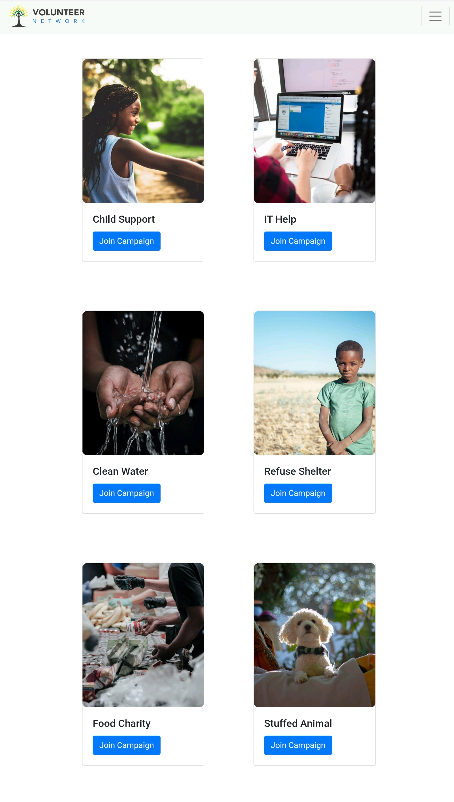
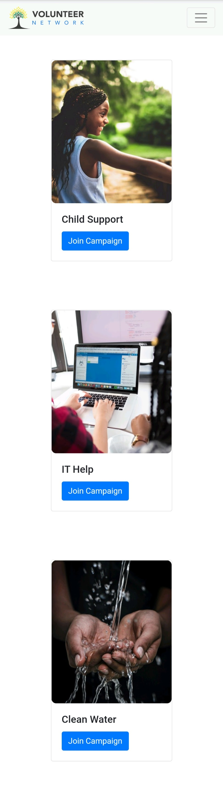
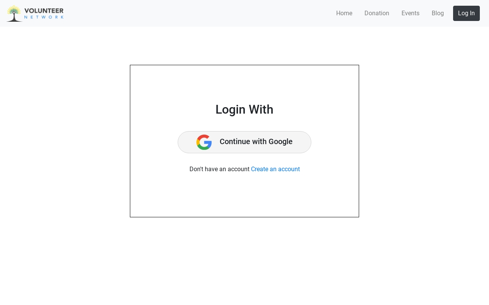
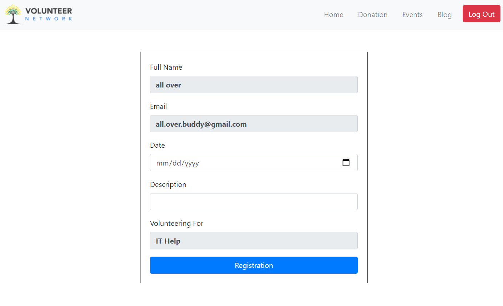
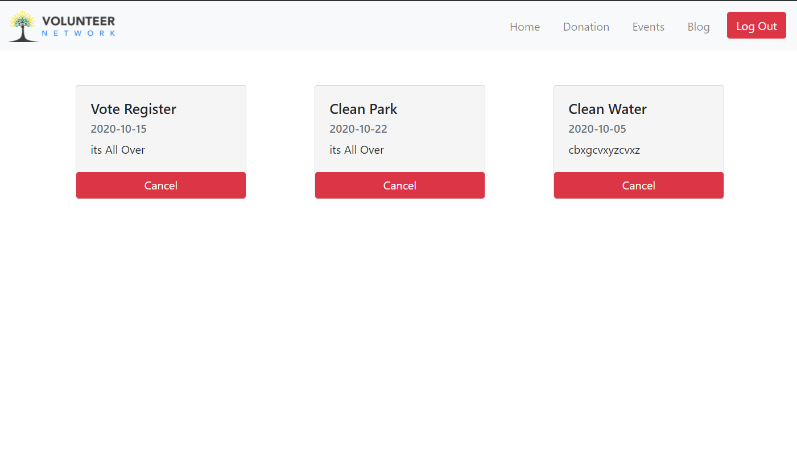

# volunteer-network-react

A site where people can take-part/register for various volunteering activities as per their choice.

### `Key Features:`

- A variety of volunteering activities are provided in the home page. All these activities are fetched from database.
- Clicking on the _Join Campaign_ button of any of these activities -

  - will take a **logged in user** to the registration form of that particular activity that the user has clicked.
  - otherwise, will take user to the login page - where user has to do the login first. And he will redirected to the registration page.

- User has to login with his GOOGLE account.
- User can see all his registered activities in his _Events_ tab. He can also _cancel/delete_ any of his registered activities there.

- In registration form there are five fields:
  - 'Full Name' and 'Email' fields are set when the user makes a successful login.
  - 'Date' field is a calender type, where user can select a convenient date for volunteering.
  - In 'Description' user can put his longings to the authority.
  - 'Volunteering For' field will set in an automatic manner whenever user clicks any of the activities in his _Home_ page.

### `Front-End Technologies:`

- React
- React Router
- Bootstrap
- Firebase Authentication
- Context API
- HTML5
- CSS3

### `Back-End Technologies:`

- Node.js
- Express.js
- MongoDB
- Heroku

---

[Visit Live Site](https://assignment-10-jm.web.app/)

[Visit Back-End Repository](https://github.com/saiffardin/volunteer-network-server)

---

### `Screenshots:`

Landing Page : Laptop

---

Landing Page : Tablet

---

Landing Page : Large Mobile

---

Log In

---

Registration Form

---

Events

---
